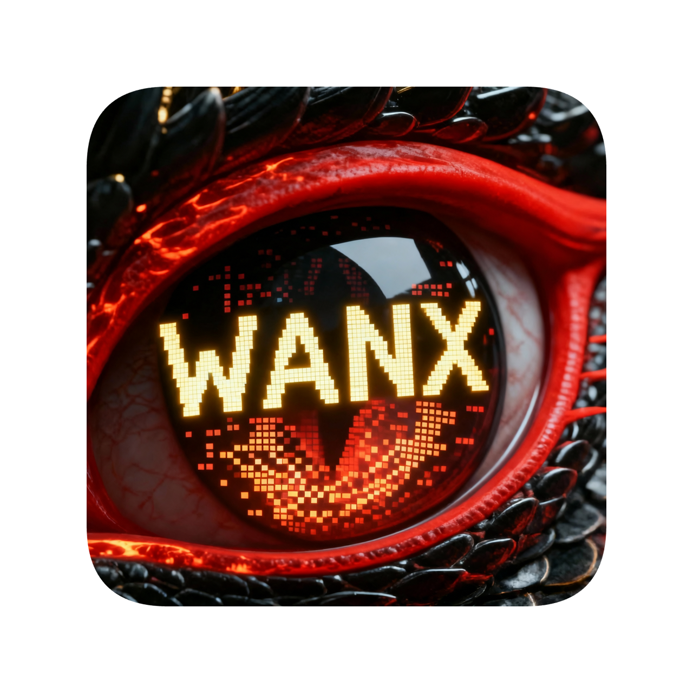

<p align="center">
  
</p>

<h1 align="center">烛龙绘影 Drawloong</h1>

<p align="center">
  <strong>🎨 基于阿里云 DashScope 的多功能 AI 创作桌面客户端</strong>
</p>

<p align="center">
  <a href="https://www.gnu.org/licenses/gpl-3.0">
    
  </a>
  <a href="https://www.python.org/downloads/">
    
  </a>
  <a href="https://pypi.org/project/PyQt5/">
    
  </a>
  
  
</p>

<p align="center">
  
</p>

---

## ✨ 功能特性

<table>
  <tr>
    <td align="center" width="25%">
      <br>
      <b>🎬 首帧生视频</b><br>
      <sub>单张图片生成动态视频</sub>
    </td>
    <td align="center" width="25%">
      <br>
      <b>🔄 首尾帧生视频</b><br>
      <sub>两帧图片生成过渡动画</sub>
    </td>
    <td align="center" width="25%">
      <br>
      <b>🎨 文生图</b><br>
      <sub>文字描述生成图片</sub>
    </td>
    <td align="center" width="25%">
      <br>
      <b>✂️ 图像编辑</b><br>
      <sub>AI智能修图与融合</sub>
    </td>
  </tr>
</table>

### 🎯 核心亮点

- **📁 工程管理** - 类似 VSCode 的项目管理体验，自动组织输入/输出文件
- **🖱️ 拖拽支持** - 从资源管理器拖拽图片，支持外部文件导入
- **🖼️ 内置预览** - 图片查看器支持缩放，视频播放器即时预览
- **⚡ 实时监控** - 任务进度实时更新，支持历史记录管理
- **🎛️ 多模型支持** - 万相2.5、万相2.2、通义千问等多种模型

---

## 🚀 快速开始

### 环境要求

| 依赖 | 版本要求 |
|------|----------|
| Python | 3.7+ |
| PyQt5 | 5.15+ |
| 操作系统 | macOS / Windows / Linux |

### 安装步骤

**方式一：一键启动（推荐）**

```bash
# macOS / Linux
./run.sh

# Windows
run.bat
```

**方式二：手动安装**

```bash
# 1. 克隆项目
git clone https://github.com/your-username/drawloong.git
cd drawloong

# 2. 创建虚拟环境
python3 -m venv venv
source venv/bin/activate  # Windows: venv\Scripts\activate

# 3. 安装依赖
pip install -r requirements.txt

# 4. 启动应用
python main.py
```

### 配置 API 密钥

**推荐方式：在应用界面中配置**

1. 访问 [阿里云 DashScope](https://dashscope.console.aliyun.com/)
2. 注册/登录账号
3. 创建 API Key
4. 启动应用后，点击右上角"⚙ 设置"按钮
5. 在设置页面输入 API 密钥并保存

**备用方式：使用环境变量（可选）**

如果需要通过环境变量配置：
```bash
# 创建 .env 文件
cp .env.example .env
# 编辑 .env 文件，填入 DashScope API 密钥
```

> 💡 **提示**：应用会优先使用界面配置的密钥，环境变量作为备用方式

---

## 📖 使用指南

### 创建工程


```
1. 启动应用 → 点击「新建工程」
2. 输入工程名称，选择保存位置
3. 点击「创建」完成
```

### 工程结构

```
我的工程/
├── 📂 pictures/        # 图集（输入图片）
├── 📂 videos/          # 视频集（输出视频）
├── 📄 project.json     # 工程配置
└── 📄 tasks.json       # 任务记录
```

> 💡 **说明**：
> - `pictures/` - 存放输入的图片素材，在资源管理器中显示为"图集"
> - `videos/` - 存放生成的视频文件，在资源管理器中显示为"视频集"
> - `project.json` - 保存工程的配置信息
> - `tasks.json` - 记录该工程的所有任务历史

### 功能使用

| 功能 | 操作步骤 |
|------|----------|
| **首帧生视频** | 上传图片 → 填写提示词 → 选择模型/分辨率 → 生成 |
| **首尾帧生视频** | 上传首帧+尾帧 → 描述过渡效果 → 生成动画 |
| **文生图** | 输入文字描述 → 选择风格/尺寸 → 生成图片 |
| **图像编辑** | 上传图片 → 输入编辑指令 → AI处理 |

---

## 🏗️ 项目结构

```
drawloong/
├── main.py                 # 应用入口
├── requirements.txt        # Python 依赖
├── wanx.spec              # PyInstaller 打包配置
│
├── config/                # ⚙️ 配置管理
│   └── settings.py
│
├── core/                  # 🧠 核心业务
│   ├── api_client.py      # DashScope API 客户端
│   ├── task_manager.py    # 任务管理
│   └── project_manager.py # 工程管理
│
├── ui/                    # 🎨 用户界面
│   ├── main_window.py     # 主窗口
│   ├── upload_widget.py   # 上传组件
│   ├── config_panel.py    # 配置面板
│   ├── task_list.py       # 任务列表
│   ├── project_explorer.py# 资源管理器
│   ├── image_viewer.py    # 图片查看器
│   ├── video_viewer.py    # 视频浏览器
│   ├── text_to_image_widget.py      # 文生图
│   ├── image_edit_widget.py         # 图像编辑
│   └── keyframe_to_video_widget.py  # 首尾帧生视频
│
└── themes/                # 🎭 主题配置
    └── themes.py
```

---

## 📦 打包发布

### Windows

```batch
# 使用打包脚本（推荐）
build_windows.bat

# 或手动打包
pip install pyinstaller
pyinstaller drawloong_windows.spec
```

输出：`dist\Drawloong\Drawloong.exe`

### macOS

```bash
# 使用打包脚本（推荐）
chmod +x build_mac.sh
./build_mac.sh

# 或手动打包
pip install pyinstaller
pyinstaller wanx.spec
```

输出：`dist/Drawloong.app`

### Linux

```bash
pip install pyinstaller
pyinstaller wanx.spec
```

输出：`dist/Drawloong/Drawloong`

> 📚 **详细说明**：查看 [BUILD_GUIDE.md](BUILD_GUIDE.md) 获取完整的打包指南，包括代码签名、创建安装包、常见问题等

---

## 🔐 安全性

| 特性 | 说明 |
|------|------|
| **密钥存储** | 使用系统安全存储，支持界面配置 |
| **数据隐私** | 所有数据本地存储，仅 API 调用时上传 |
| **工程隔离** | 各工程数据独立，互不干扰 |

---

## 🤝 贡献指南

欢迎提交 Issue 和 Pull Request！

1. Fork 本仓库
2. 创建特性分支 (`git checkout -b feature/AmazingFeature`)
3. 提交更改 (`git commit -m 'Add some AmazingFeature'`)
4. 推送到分支 (`git push origin feature/AmazingFeature`)
5. 提交 Pull Request

### 开发规范

- 遵循 PEP 8 代码风格
- 使用有意义的变量和函数命名
- 添加必要的注释和文档
- 确保代码通过测试

---

## 📄 开源许可

本项目采用 **GNU General Public License v3.0** 开源协议。

[](https://www.gnu.org/licenses/gpl-3.0)

### 第三方组件

| 组件 | 许可证 | 用途 |
|------|--------|------|
| [PyQt5](https://www.riverbankcomputing.com/software/pyqt/) | GPL-3.0 | GUI 框架 |
| [requests](https://requests.readthedocs.io/) | Apache-2.0 | 网络请求 |
| [python-dotenv](https://github.com/theskumar/python-dotenv) | BSD-3-Clause | 环境变量 |

详见 [LICENSE](LICENSE) 和 [NOTICE](NOTICE) 文件。

---

## 📈 更新日志

### v1.14.0 (2025-12-15)
- 🌟 新增万相2.6模型支持（最新模型）
- ⏱️ 支持5秒、10秒、15秒三种时长选择
- 🎬 新增智能镜头类型选择：多镜头/单镜头
- 📺 分辨率支持720P和1080P（2.6模型不支持480P）
- 📚 添加万相2.6快速使用指南

### v1.13.0 (2025-12-15)
- ✨ 首尾帧页面图片预览区域增大，显示更清晰
- ✨ 视频集点击播放功能：在首尾帧页面点击视频时在该页面播放
- 🎨 资源管理器界面优化：隐藏分割器手柄，界面更简洁
- 🎯 图集和视频集文件过滤：图集只显示图片，视频集只显示视频
- 🖼️ 视频预览图功能：视频集显示视频第一帧作为预览图
- 🐛 修复Task对象属性错误

### v1.12.0 (2025-12-14)
- ✨ 新增图集拖拽到各功能页面
- ✨ 首帧生成视频新增双按钮选择
- 🔧 配置面板添加滚动条
- 🐛 修复视频时长参数传递问题

### v1.11.0 (2025-12-12)
- ✨ 提示词展示功能优化

### v1.10.0 (2025-12-12)
- ✨ 智能错误提示系统

<details>
<summary>查看更多版本</summary>

### v1.8.0 - v1.9.0
- 新增万相文生图模型
- API 差异化处理优化

### v1.5.0 - v1.7.0
- 多标签页架构
- 文生图异步调用
- 万相2.5 Preview 模型

### v1.3.0 - v1.4.0
- 拖拽与文件浏览功能
- 视频浏览器增强

### v1.2.0
- 工程管理系统

### v1.1.0
- 界面配置 API 密钥

</details>

---

## 🙏 致谢

- [阿里云 DashScope](https://dashscope.console.aliyun.com/) - AI 能力支持
- [PyQt5](https://www.riverbankcomputing.com/software/pyqt/) - GUI 框架
- 所有贡献者和用户

---

<p align="center">
  <sub>Made with ❤️ by Drawloong Team</sub>
</p>
