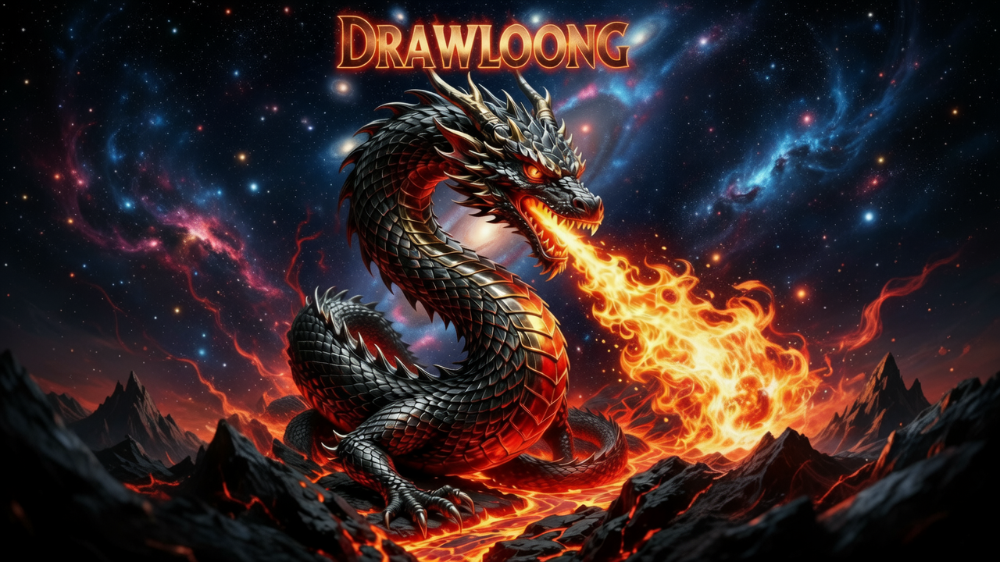

<p align="center">
  
</p>

<h1 align="center">Drawloong</h1>

<p align="center">
  <strong>Multi-functional AI Creative Desktop Client Based on Alibaba Cloud DashScope</strong>
</p>

<p align="center">
  <a href="README.md">🇨🇳 中文</a> | <a href="README_EN.md">🇺🇸 English</a>
</p>

<p align="center">
  <a href="https://www.gnu.org/licenses/gpl-3.0">
    
  </a>
  <a href="https://www.python.org/downloads/">
    
  </a>
  <a href="https://pypi.org/project/PyQt5/">
    
  </a>
  
  
</p>

<p align="center">
  
</p>

---

## Features

| Feature | Description |
|---------|-------------|
| **Image-to-Video** | Generate dynamic videos from single images |
| **Keyframe-to-Video** | Create transition animations between two frames |
| **Reference Video-to-Video** | Generate new scenes based on reference videos |
| **Text-to-Image** | Generate images from text descriptions |
| **Image Editing** | AI-powered intelligent image editing and fusion |

### Core Highlights

- **Project Management** - VSCode-like project management experience with automatic input/output file organization
- **Drag & Drop Support** - Drag images from file explorer with external file import support
- **Built-in Preview** - Image viewer with zoom support, video player for instant preview
- **Real-time Monitoring** - Real-time task progress updates with history management
- **Multi-model Support** - WanXiang 2.6, WanXiang 2.5, WanXiang 2.2, Qwen and other models

---

## Quick Start

### Requirements

- Python 3.7+
- PyQt5 5.15+
- macOS / Windows / Linux

### Installation

**Method 1: One-click Launch (Recommended)**

```bash
# macOS / Linux
./run.sh

# Windows
run.bat
```

**Method 2: Manual Installation**

```bash
# Clone the repository
git clone https://github.com/your-username/drawloong.git
cd drawloong

# Create virtual environment
python3 -m venv venv
source venv/bin/activate  # Windows: venv\Scripts\activate

# Install dependencies
pip install -r requirements.txt

# Launch application
python main.py
```

### Configure API Key

1. Visit [Alibaba Cloud DashScope](https://dashscope.console.aliyun.com/) to get API Key
2. Launch the application and click the "Settings" button
3. Enter your API key in the settings page and save

---

## User Guide

### Create Project

Launch App → Click "New Project" → Enter project name → Select save location → Create

### Project Structure

```
My Project/
├── pictures/        # Image collection (input images)
├── videos/          # Video collection (output videos)
├── project.json     # Project configuration
└── tasks.json       # Task records
```

### Feature Usage

| Feature | Steps |
|---------|-------|
| **Image-to-Video** | Upload image → Enter prompt → Select model/resolution → Generate |
| **Keyframe-to-Video** | Upload first+last frame → Describe transition → Generate animation |
| **Reference Video-to-Video** | Upload reference video → Use character1/2 descriptions → Generate new scene |
| **Text-to-Image** | Enter text description → Select style/size → Generate image |
| **Image Editing** | Upload image → Enter editing instructions → AI processing |

---

## Project Structure

```
drawloong/
├── main.py                 # Application entry point
├── requirements.txt        # Python dependencies
├── config/                 # Configuration management
├── core/                   # Core business (API, tasks, project management)
├── ui/                     # User interface components
└── themes/                 # Theme configuration
```

---

## Build & Package

### Windows

```batch
build_windows.bat
```

Output: `dist\Drawloong\Drawloong.exe`

### macOS

```bash
./build_mac.sh
```

Output: `dist/Drawloong.app`

For detailed instructions, see [BUILD_GUIDE.md](BUILD_GUIDE.md)

---

## Security

- **Key Storage** - Uses system secure storage with UI configuration support
- **Data Privacy** - All data stored locally, only uploaded during API calls
- **Project Isolation** - Each project's data is independent and isolated

---

## Contributing

Issues and Pull Requests are welcome!

1. Fork this repository
2. Create a feature branch (`git checkout -b feature/AmazingFeature`)
3. Commit your changes (`git commit -m 'Add some AmazingFeature'`)
4. Push to the branch (`git push origin feature/AmazingFeature`)
5. Submit a Pull Request

---

## License

This project is licensed under the **GNU General Public License v3.0**.

### Third-party Components

| Component | License | Purpose |
|-----------|---------|---------|
| PyQt5 | GPL-3.0 | GUI Framework |
| QFluentWidgets | GPL-3.0 | Fluent UI Components |
| requests | Apache-2.0 | HTTP Requests |
| opencv-python | MIT | Video Thumbnail Generation |

---

## Changelog

### v1.17.0 (2025-12-23)

- **New Z-Image Turbo Model** - Ultra-fast text-to-image generation with lightweight model
- **WanXiang 2.6 Batch Generation** - Support 1-4 image batch generation for improved efficiency
- **WanXiang 2.5/2.2 Batch Optimization** - Single API call instead of multiple calls, reducing requests by 75%
- **Qwen Model Limitation Fix** - Correctly limited to single image generation to avoid API errors
- **Intelligent Error Handling System** - Detailed error classification and solution suggestions for better UX
- **Dynamic UI Adjustment** - Automatically adjust interface options based on different model capabilities

### v1.16.2 (2025-12-19)

- Welcome page full-screen background optimization
- Fixed QFluentWidgets TabWidget compatibility issues
- Windows build script supports multiple mirror sources
- Simplified README, removed skeuomorphic icons

### v1.16.1 (2025-12-19)

- Comprehensive UI optimization - Reference video generation and keyframe generation pages with Fluent design
- Four-quadrant layout - Unified layout style
- Fixed issue where videos were downloaded twice upon task completion
- Fixed QFluentWidgets ComboBox compatibility issues

### v1.16.0 (2025-12-18)

- Brand new QFluent UI interface beautification
- New Fluent Design style theme system
- New drawer-style project resource explorer and task list
- New Fluent style status bar

### v1.15.2 (2025-12-16)

- Strict file type control for image and video collections
- Automatic file type recognition during drag-and-drop import

### v1.14.0 (2025-12-15)

- Added WanXiang 2.6 model support
- Support for 5s, 10s, 15s duration options
- New intelligent camera type selection

<details>
<summary>View More Versions</summary>

### v1.13.0 (2025-12-15)

- Enlarged image preview area on keyframe page
- Video collection click-to-play functionality
- Resource explorer interface optimization

### v1.12.0 (2025-12-14)

- Added image collection drag-and-drop to feature pages
- New dual-button selection for first-frame video generation

### v1.11.0 (2025-12-12)

- Prompt display functionality optimization

### v1.10.0 (2025-12-12)

- Intelligent error notification system

</details>

---

## Acknowledgments

- [Alibaba Cloud DashScope](https://dashscope.console.aliyun.com/) - AI capabilities support
- [PyQt5](https://www.riverbankcomputing.com/software/pyqt/) - GUI framework
- [QFluentWidgets](https://github.com/zhiyiYo/PyQt-Fluent-Widgets) - Fluent UI components

---

<p align="center">
  <sub>Made with ❤️ by Drawloong Team</sub>
</p>